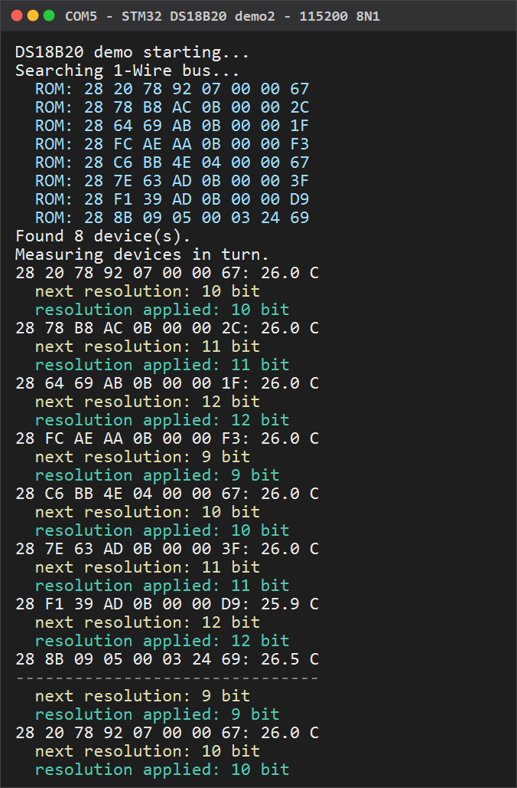
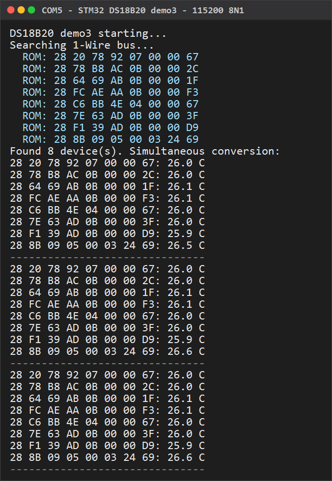
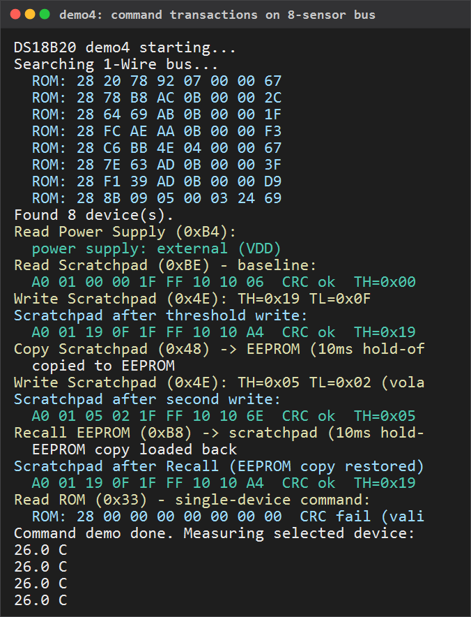

[](https://github.com/a5021/non-blocking-ds18B20-driver-for-stm32f103c8t6/actions/workflows/build.yml)
[](https://github.com/a5021/non-blocking-ds18B20-driver-for-stm32f103c8t6/actions/workflows/ci.yml)
[](https://opensource.org/licenses/MIT)
# Non-Blocking DS18B20 Driver for STM32F103

A bare-metal, register-level driver for the DS18B20 temperature sensor. This driver uses a sophisticated hybrid architecture with a hardware timer (TIM1) and DMA to achieve precise 1-Wire protocol timing. All timing is handled by hardware — the CPU never waits, never spins, and never enters an interrupt.

## Features

- Pure Bare-Metal: Direct register manipulation, no HAL or LL libraries.
- Zero Interrupts: Does not use any NVIC interrupts. Fully polled operation.
- Hardware Automation: Uses TIM1 Output Compare and Input Capture with DMA to automate waveform generation and data capture.
- State Machine Architecture: Event-driven operation controlled by hardware completion signals.
 - Weak Function Callbacks: Hooks for driver busy state and measurement completion.
 - CRC Validation: CRC-8 ensures every sensor reading is checked for data integrity.
 - Non-Blocking Device Search: `ds18b20_search_start()`, `ds18b20_search_poll()`,
   `ds18b20_search_count()` find every DS18B20 on the bus. The engine is the
   generic Search ROM state machine of the shared 1-Wire layer; the driver
   stays a small high-level interface on top of it.
 - Universal 1-Wire Layer: `inc/onewire.h` + `src/onewire.c` — a reusable,
   non-blocking 1-Wire master. The bus primitives (reset, presence, write/read
   slots, multi-byte read) and the generic Maxim Search ROM engine are
   scheduled on TIM1/DMA and complete asynchronously. `src/ds18b20.c` is built
   on this layer, and other 1-Wire slaves (DS2413, DS2431, ...) can reuse it
   as-is.
 - Non-Blocking Alarm Search: `ds18b20_alarm_search_start()`,
    `ds18b20_alarm_search_poll()`, `ds18b20_alarm_search_count()` report only the
    DS18B20 devices currently in alarm state (temperature outside the TH/TL
    thresholds set with Write Scratchpad). It uses the same Maxim search engine
    as the device search and leaves the scan-mode device table untouched.
 - Non-Blocking Command Transactions: `ds18b20_read_rom()`,
    `ds18b20_set_alarm_thresholds()`, `ds18b20_read_scratchpad()`,
    `ds18b20_copy_scratchpad()`, `ds18b20_recall_eeprom()` and
    `ds18b20_read_power_supply()` drive the DS18B20 commands
    (0x33 / 0x4E / 0xBE / 0x48 / 0xB8 / 0xB4) with the same poll discipline as
    the device search — each `*_poll()` advances one hardware operation and
    hands the timer back to `ds18b20_poll()` when the transaction finishes.
    See `demo4.c`.
 - Per-Device Addressing: Select one specific sensor by its ROM address
   (`ds18b20_select()`, Match ROM 0x55) for use with multiple devices on one bus.
 - Resolution-Aware Conversion Wait: The driver waits exactly as long as the
   configured conversion resolution requires (93.75ms @ 9-bit … 750ms @ 12-bit),
   so lowering the resolution speeds up the measurement cycle.
 - Non-Blocking Resolution Change: `ds18b20_set_resolution()` /
    `ds18b20_set_resolution_poll()` change the conversion resolution (9..12 bit)
    between measurement cycles with zero busy-waits, mirroring the device search
    state machine. The resolution is also auto-derived from every valid
    scratchpad read (`ds18b20_get_resolution()`).
 - Simultaneous Multi-Device Conversion: `ds18b20_scan_start()` converts every
    discovered sensor in parallel with one broadcast `Convert T` (Skip ROM) and
    reads each one back via Match ROM, so N devices take one conversion wait
    plus N reads. Each reading is reported through `ds18b20_complete()` in
    device-table order; `ds18b20_scan_index()`, `ds18b20_device_rom()` and
    `ds18b20_device_count()` identify the sensors (requires the device search
    to have run first; assumes a uniform resolution).

## Requirements

- Microcontroller: STM32F103C8T6 (Blue Pill) or compatible
- Sensor: DS18B20 digital temperature sensor
- Toolchain: GCC ARM (arm-none-eabi)
- Clock Configuration: 72MHz via HSE+PLL (default) or 8MHz via HSI (`make HSI_8MHZ=1`)

## File Structure

```
├── inc/                    # Project header files
│   ├── ds18b20.h           # Driver interface (high-level API) and constants
│   ├── onewire.h           # Shared 1-Wire layer (bus primitives + Search ROM)
│   ├── app.h               # Shared application layer (UART, clock, init)
│   └── macro.h             # STM32 register access macros
├── src/                    # Project source files
│   ├── app.c               # app_init(), UART TX ring buffer, busy LED
│   ├── demo.c              # Example: single sensor, unconditional (Skip ROM)
│   ├── demo2.c             # Example: device search + sequential poll of all
│   ├── demo3.c             # Example: device search + simultaneous conversion
│   ├── demo4.c             # Example: device search + command transactions
│   │                       # (ROM, power supply, TH/TL, Copy/Recall EEPROM)
│   ├── onewire.c           # 1-Wire layer: state machine + bus primitives
│   │                       #               + non-blocking Search ROM engine
│   └── ds18b20.c           # Driver: DS18B20 command set on the 1-Wire layer
├── CMSIS/                  # Build-time dependencies (gitignored)
│   ├── core/               # ARM CMSIS 5 core headers
│   └── device/             # STM32F1 device headers and startup
├── .vscode/                # VSCode workspace configuration
│   ├── tasks.json          # Build tasks (Ctrl+Shift+B)
│   ├── launch.json         # Debug configuration (F5, J-Link / ST-Link)
│   ├── c_cpp_properties.json  # IntelliSense paths
│   ├── extensions.json     # Recommended extensions
│   └── settings.json       # Editor settings
├── build/                  # Build artifacts (generated)
├── STM32F103XB_FLASH.ld    # Linker script (with .noinit section)
├── Makefile
└── stm32f103cb.jflash      # J-Flash project file
```

## Examples

Four ready-to-run example applications are provided; select one with `APP`:

| APP     | File             | Behaviour                                                        |
|---------|------------------|------------------------------------------------------------------|
| `demo`  | `src/demo.c`     | Unconditional polling of a single DS18B20 via Skip ROM (0xCC).   |
| `demo2` | `src/demo2.c`    | Startup device search + sequential polling of every sensor found (up to `DS18B20_SEARCH_MAX_DEVICES`). |
| `demo3` | `src/demo3.c`    | Startup device search + simultaneous broadcast conversion: one `Convert T` (Skip ROM) converts all sensors in parallel, then each is read back via Match ROM. |
| `demo4` | `src/demo4.c`    | Startup device search + non-blocking command transactions on the first sensor: Read Power Supply (0xB4), raw Read Scratchpad (0xBE), Write Scratchpad TH/TL (0x4E), Copy Scratchpad (0x48) to the EEPROM, Recall EEPROM (0xB8), single-device Read ROM (0x33), then steady-state measurement of the selected device. |

```bash
make                # build demo  -> build/ds18b20_demo.elf
make APP=demo2      # build demo2 -> build/ds18b20_demo2.elf
make APP=demo3      # build demo3 -> build/ds18b20_demo3.elf
make APP=demo4      # build demo4 -> build/ds18b20_demo4.elf
make debug APP=demo2  # debug build of demo2 (for J-Link/ST-Link)
```

Notes:

- All examples use `app_init()` (from `inc/app.h`) to set up the system
  clock, USART1 TX and the busy LED in a single call.
- `demo` uses Skip ROM, so it is meant for a **single sensor** on the bus.
  With several sensors connected, all of them respond to the read command and
  the bus data collides (CRC failures are expected).
- `demo2` measures the devices found at startup one at a time, in round-robin
  order. With exactly one sensor it behaves like `demo`.
- `demo3` (scan mode) converts every discovered sensor in parallel: a single
  conversion wait covers all devices, so N devices take `1 x conversion + N x
  read` instead of `N x conversion`. Each reading is reported through
  `ds18b20_complete()` in device-table order; `ds18b20_scan_index()` /
  `ds18b20_device_rom()` identify the sensor. Scan mode assumes a uniform
  resolution (the config is written broadcast) and is mutually exclusive with
  `ds18b20_select()`.
- `demo4` targets the first sensor found by the search (Match ROM) and runs the
  non-blocking command sequence once at startup: power supply, raw scratchpad,
  TH/TL write with a Copy/Recall pair to demonstrate EEPROM persistence, and
  the single-device Read ROM. Each command advances by one hardware operation
  per `*_poll()` call; `ds18b20_last_command_ok()` verifies the result.
- Programming targets (`make jprogram` / `make program`) flash whichever
  example is currently selected by `APP`.

## Hardware Verified

The following captures were taken on real hardware: STM32F103C8T6 (Blue Pill),
8 × DS18B20 on one 1-Wire bus (PA8), flashed via ST-Link, USART1 TX at
115200 8N1 read through a CP2102 USB-UART adapter. The shared 1-Wire layer
found all 8 sensors, and every measurement round reported all of them — no
missing devices, no CRC failures.

**demo2 — device search + round-robin + resolution cycling** (`src/demo2.c`):
the startup Search ROM finds all 8 devices, then each sensor is measured in
turn while the resolution cycles 9 → 10 → 11 → 12 bit between measurements.

<p align="center">
  
</p>

**demo3 — simultaneous multi-device conversion** (`src/demo3.c`): one broadcast
`Convert T` converts all sensors in parallel, then each is read back via
Match ROM — 8 readings per round in device-table order.

<p align="center">
  
</p>

**demo4 — command transactions** (`src/demo4.c`): after the startup search, the
first sensor (Match ROM) answers every non-blocking command in turn — external
power confirmed, raw scratchpad read with CRC ok and the resolution auto-derived
from the config byte, TH/TL written (0x19/0x0F), copied to the EEPROM, then a
volatile write (0x05/0x02) and Recall restoring the persisted values, and the
bare Read ROM reporting a CRC failure as expected with 8 devices on the bus
(0x33 is single-device only).

<p align="center">
  
</p>

## Hardware Connections

### DS18B20 Sensor

| STM32F103 Pin | Function     | DS18B20 Pin |
|---------------|--------------|-------------|
| PA8           | 1-Wire Data  | DQ (Data)   |
| 3.3V          | Power        | VDD         |
| GND           | Ground       | GND         |

Note: A 4.7kΩ pull-up resistor is required between the PA8 and 3.3V lines.

### Debug UART (optional)

| STM32F103 Pin | Function            | USB-UART Adapter |
|---------------|---------------------|------------------|
| PA9           | USART1 TX (115200)  | RX               |
| GND           | Ground              | GND              |

Connect a USB-UART adapter to see diagnostic output (sensor errors,
temperature readings). No RX connection is needed — the firmware is
transmit-only.

The UART output uses a ring buffer with polled TX (TXE flag checked
in main loop) — fully non-blocking, no interrupts.

## Quick Start

### 1. Include the Driver

```C
#include "ds18b20.h"
```

### 2. Initialize the Driver

```C
int main(void) {
    ds18b20_init();  // One-time initialization

    // Optional: run the non-blocking device search to find every sensor on
    // the bus. See demo2.c for a complete example. The search hands the
    // driver back to poll() automatically when finished.

    // Optional: measure one specific device by its ROM address
    ds18b20_select(my_rom);  // my_rom from a bus search

    while (1) {
        ds18b20_poll();  // Call repeatedly from main loop
        // Other application code...
    }
}
```

### 3. Implement Callbacks (Optional)

Both callbacks are optional. Default weak implementations are provided by the
driver, and `src/app.c` additionally supplies a default `ds18b20_busy()` that
drives the onboard LED (PC13). The examples override both: `ds18b20_busy()`
switches the LED and `ds18b20_complete()` formats and prints the result.

```C
// Busy indicator — e.g. LED toggling during measurement
void ds18b20_busy(unsigned action) {
    if (action) {
        // Turn LED on (measurement in progress)
        GPIOC->BSRR = GPIO_BSRR_BR13;
    } else {
        // Turn LED off (measurement complete)
        GPIOC->BSRR = GPIO_BSRR_BS13;
    }
}

// Measurement complete callback — handle result or error
void ds18b20_complete(int16_t temp) {
    if (temp >= -550 && temp <= 1250) {
        // Valid temperature in tenths of °C
        printf("Temperature: %d.%d°C\n", temp/10, abs(temp%10));
    } else {
        // Error condition
        switch (temp) {
            case DS18B20_TEMP_ERROR_NO_SENSOR:
                printf("Error: No sensor detected\n");
                break;
            case DS18B20_TEMP_ERROR_CRC_FAIL:
                printf("Error: CRC check failed\n");
                break;
        }
    }
}
```
## Building

### Prerequisites

-   **Toolchain:** `arm-none-eabi-gcc` (GCC 12+ recommended) and related
    utilities (`objcopy`, `size`).
-   **wget:** Required for downloading CMSIS build dependencies.
-   **Programmer tools:**
    -   **ST-LINK:** `st-flash` (Linux/macOS) or `ST-LINK_CLI.exe` (Windows)
    -   **J-LINK:** `JFlashExe` / `JFlash.Exe` / `JLinkGDBServerCL.exe`

### CMSIS Dependencies

ARM CMSIS core headers and STM32F1 device files are not stored in the
repository. They are downloaded automatically at build time to
`CMSIS/core/` and `CMSIS/device/`:

```bash
make download-deps
```

To remove them:

```bash
make clean-deps
```

License files are also downloadable:

```bash
make download-licenses
```

### Build

```bash
make            # Release build (-Os -flto -g0)
make debug      # Debug build (-Og -g3 -gdwarf)
```

Output goes to `build/` (`ds18b20_demo.elf`, `.hex`, `.bin`).

### Common Targets

| Target | Description |
|--------|-------------|
| `make` / `make all` | Build release |
| `make debug` | Build with debug symbols |
| `make test` | Build and run host tests (PC toolchain) |
| `make clean` | Remove build artifacts |
| `make download-deps` | Download CMSIS dependencies |
| `make clean-deps` | Remove downloaded dependencies |
| `make program` | Flash via ST-LINK |
| `make jprogram` | Flash via J-LINK |
| `make help` | Show all targets |

### Flash

-   **ST-LINK:** `make program` (uses `st-flash` / `ST-LINK_CLI.exe`)
-   **J-LINK:** `make jprogram` (uses `JFlashExe` / `JFlash.Exe`)

### Testing

The driver ships with a host test suite that runs entirely on the PC, no
hardware required:

```bash
make test
```

Both `src/onewire.c` and `src/ds18b20.c` are compiled as a single translation
unit (`tests/mock/ds18b20_test_access.c`) against a behavioural model of the
TIM1/DMA hardware (`tests/mock/hw_model.c`) and a register mock of the STM32F1
CMSIS header. 198 tests cover:

-   State machine transitions (idle → start → measure → read → decode)
-   Non-blocking device search (Search ROM, ROM CRC validation, multi-device)
-   Non-blocking alarm search (Alarm Search ROM, 0xEC command feed, scan-table
    isolation)
-   Non-blocking resolution change (`ds18b20_set_resolution_*`): exact wait
    timings for 9/10/11/12 bit, Skip ROM and Match ROM config writes, CCR1-feed
    bus release, ownership guards, presence-abort and scratchpad auto-derivation
-   Non-blocking command transactions (`ds18b20_read_rom`,
    `ds18b20_set_alarm_thresholds`, `ds18b20_read_scratchpad`,
    `ds18b20_copy_scratchpad`, `ds18b20_recall_eeprom`,
    `ds18b20_read_power_supply`): command feed builds (Skip/Match ROM),
    resolution-preserving TH/TL writes, raw scratchpad read + CRC +
    resolution auto-derivation, 10 ms Copy/Recall hold-offs, power-supply
    decode, ownership guards, presence-abort and result reporting
-   CRC-8 (Dallas/Maxim) verification
-   1-Wire pulse encoding and presence detection
-   1-Wire layer coverage: reset/presence timing, write-then-read merge,
-    multi-slot writes, multi-byte reads, search engine (device + alarm),
-    ownership guards and the search edge buffers
-   Scratchpad decode and temperature conversion (incl. negative values)
-   Timing configuration and register setup
-   Bus release behaviour between slots

### **Configuration Notes**

-   **Target Name:** The firmware target name is `ds18b20_demo`.

-   **Build Directory:** Default is `build/`.

-   **Optimization Level:**

    -   **Release:** `-Os -flto -g0` (default).
    -   **Debug:** `-Og -g3 -gdwarf`.

-   **MCU Flags:** Configured for `STM32F103xB` (Cortex-M3).

-   **HSI 8MHz Build:** By default the firmware runs on HSE 8MHz + PLL
    ×9 = 72MHz. Pass `HSI_8MHZ=1` to use the internal RC oscillator
    (HSI) at 8MHz without an external crystal or PLL:

    ``` bash
    make HSI_8MHZ=1
    make debug HSI_8MHZ=1
    ```

    The timer prescaler and USART baud rate are adjusted automatically.
    Useful for testing on bare minimum hardware (no HSE crystal).

## VSCode Integration

The repository includes `.vscode/` workspace configuration for a
convenient development workflow.

### Building

Press **Ctrl+Shift+B** to run the default build task (`make`). Other
tasks are available via **Ctrl+Shift+P** → "Tasks: Run Task":

- `Build (release)` — `make` (default)
- `Build (debug)` — `make debug`
- `Clean` — `make clean`
- `Program (J-Link)` / `Program (ST-Link)` — flash the device
- `Download dependencies` — `make download-deps`

### Debugging

1. In the **Run and Debug** panel (`Ctrl+Shift+D`), select the debug
   configuration: **"Debug (J-Link)"** or **"Debug (ST-Link)"**.
2. Open `src/demo.c` and set a breakpoint in `main()`.
3. Press **F5** — Cortex-Debug will build the firmware in debug mode,
   flash it, run to `main()`, and halt.

The SVD file is loaded automatically for peripheral register views in
the debug sidebar.

**J-Link:** Connect a SEGGER J-Link debugger via SWD.  
**ST-Link:** Connect an ST-Link programmer (built into most Blue Pill
boards) via SWD.

## Comparison with Common 1-Wire Techniques

The DS18B20 uses the 1-Wire bus protocol, which communicates over a single data
line with strict timing requirements. Several approaches exist to handle this
protocol on embedded systems:

| Technique | How it works | Blocking? | Timing precision | Typical use |
|---|---|---|---|---|
| **Bit-banging + delay** (e.g. OneWire Arduino) | GPIO toggling with `delayMicroseconds()`, interrupts disabled | Yes | Low (compiler/optimization dependent) | Hobbyist Arduino projects |
| **Bit-banging + timer ISR** | Timer interrupt drives GPIO transitions | Semi- | Medium | RTOS-based firmware |
| **UART bit-banging** | UART at 9600/115200 baud emulates 1-Wire timings | Depends | Medium | Systems with spare UARTs |
| **Hardware 1-Wire master** | Dedicated IC (DS2482) or kernel subsystem (Linux w1-gpio) | No | High | Linux SBCs, complex systems |
| **Timer + DMA + One-Pulse Mode** (this driver) | DMA feeds CCR values autonomously; timer self-disables after each transaction | No | High (1µs resolution, zero jitter) | STM32 resource-constrained firmware |

### Trade-offs

**Cost.** This driver consumes dedicated hardware resources — TIM1 and two DMA1
channels (CH3 for input capture, CH4 for the CCR1 feed) — that cannot be used
for other purposes. The 1-Wire data line itself occupies PA8, but any approach
needs a GPIO pin for the bus, so that is not an extra cost. Bit-banging
approaches, by contrast, need only that one pin and no DMA, making them more
portable across MCUs with limited peripherals.

**Precision vs. portability.** Timer+DMA provides deterministic 1µs resolution
with zero jitter, because the CPU is never in the timing-critical path. Software
delays degrade under interrupt load, and even timer-ISR approaches incur jitter
from preemption. The trade-off is complexity: this driver's hardware configuration
is ~150 lines of register-level code versus ~20 lines for a typical bit-bang
implementation.

## Architecture

### Hybrid Hardware Automation

This driver uses an advanced technique that combines multiple hardware features:

1. Timer-Driven Sequences: TIM1 is configured in One-Pulse Mode (OPM). Each state machine step configures the timer for a specific operation (reset, write byte, read byte, wait) and starts it.
2. DMA for Data Transfer: DMA is used in two key ways:
   - Transmit (DMA1_Channel4): Feeds a pre-calculated sequence of Compare Register (CCR) values to TIM1->CCR1 to automatically generate the precise waveform for writing commands or bits.
   - Capture (DMA1_Channel3): Automatically stores values from the TIM1->CCR2 capture register into memory to record pulse timings during read operations or presence detection.
3. Update Event as Completion Signal: The core polling mechanism checks the Timer Update Flag (TIM1->SR UIF). This flag is set when the timer completes its one-pulse countdown, signaling that the autonomous hardware operation (e.g., sending a reset pulse, waiting 750ms) is finished.
4. True Zero-ISR Overhead: The ds18b20_poll() function checks this flag. When set, it clears the flag and advances the state machine to the next step. This makes the entire driver event-driven by hardware completion signals without using interrupts.

### Non-Blocking, Interrupt-Free Design Principles

1. No Software Delays: No `delay_us()` or similar functions.
2. No Interrupts: Does not configure or use the NVIC. Fully deterministic.
3. Hardware Completion Events: The state machine advances only when the hardware timer signals that its current automated task is complete.
 4. Minimal CPU During Operations: The CPU is only actively involved to set up a hardware operation and to process the result once it completes.

> The driver ships with a built-in non-blocking device search
> (`ds18b20_search_*`) for multi-sensor buses. The Maxim Search ROM (0xF0)
> algorithm is implemented as a compact state machine in the shared 1-Wire
> layer; it performs exactly one hardware-timed operation per poll call,
> consistent with the non-blocking measurement path. See `demo2.c` for a
> complete Search ROM example.

### Shared 1-Wire Layer

All bus-level protocol lives in `src/onewire.c` (interface in `inc/onewire.h`),
a reusable 1-Wire master that the DS18B20 driver builds on:

- `onewire_init()`, `onewire_reset()`, `onewire_present()`,
  `onewire_write_slots()`, `onewire_write_bit()`, `onewire_encode_byte()`,
  `onewire_read_pair()`, `onewire_write_then_read()`, `onewire_pair_bits()`,
  `onewire_read_data()`, `onewire_start_timer()`, `onewire_bus_done()` — the
  TIM1/DMA bus primitives.
- `onewire_search_start()`, `onewire_search_poll()`,
  `onewire_search_count()`, `onewire_search_active()` — the generic Maxim
  Search ROM engine, shared by `ds18b20_search_*` and
  `ds18b20_alarm_search_*`.
- `onewire_crc8()` — the Dallas/Maxim CRC-8 utility.

Every operation is scheduled as one hardware transaction on TIM1/DMA and
completes asynchronously; the caller advances it by polling
`onewire_bus_done()` / `onewire_search_poll()`. The layer owns its own capture
edge buffers, keeps the line released to idle HIGH after every transaction, and
is fully covered by the host test suite. See the API Reference below for the
complete `onewire_*` surface.

### Hardware Resources Used

- TIM1 & Channels 1, 2, 4: The core timer resources.
  - CH1 (PWM Mode 2, Output Compare): Configured in PWM Mode 2, driving PA8 as the 1-Wire output on an active-low bus.
     - Each 1-Wire bit time slot is implemented as a single PWM period
       with a low (active) portion encoding the bit:
       - Short low (~5µs) → logical '1'
       - Long low (~60µs) → logical '0'
     - Total slot = `ONE_PULSE + ZERO_PULSE + guard` = 5 + 60 + 5 = 70µs.
       The +5µs guard band prevents overlap between consecutive slots
       due to bus rise time and DMA latency.
    - Reset (~480µs) is generated as an extended low period (active-low) within a ~960µs slot.
  - CH2 (Input Capture, Indirect mode): Shares the same PA8 pin internally. Used to capture presence pulses and read-slot timings after CH1 releases the bus to idle-high; DMA transfers CCR2 capture values to memory.
  - CH4: Used as a DMA trigger, feeding CCR1 duty cycles (for CH1 output) and facilitating capture operations.
- RCR (Repetition Counter Register): Key to the state machine operation. Instead of generating an Update Event on every period, RCR controls how many timer repetitions occur before UIF is set.
  - Example: RCR=15 → the timer generates 16 PWM slots (bits) via DMA, then asserts UIF once at the end, signaling software to proceed.
  - This allows grouping a full command (two bytes), the entire 72-bit read, or long delays into single hardware-driven transactions, freeing the CPU until completion.
- DMA1_Channel3: Peripheral-to-memory transfers from TIM1->CCR2 (captured timings).
- DMA1_Channel4: Memory-to-peripheral transfers to TIM1->CCR1 (PWM duty cycles).
- GPIO Pin: PA8 configured in alternate function open-drain; CH1 output and CH2 capture are multiplexed onto this single pin.

### State Machine Flow (hardware-timed; polled on UIF)

Kickstart behavior
- After ds18b20_init(), the timer update flag (UIF) is already set. This ensures the very first call to ds18b20_poll() advances the state machine immediately without any extra priming step.

- IDLE (state 0)
  - Immediately falls through into START with no events required. Prepares context (ctx.fill_union = -1), ensures LED is off.
  - Set state=1.

- START (state 1)
  - LED on. Run reset_bus():
    - CH1 issues active-low reset pulse (~480µs within ~960µs slot).
    - CH2 (indirect input) captures presence timing into ctx.edge[0..1] via DMA from CCR2.
  - Set state=2.

- CONVERT (state 2)
  - On UIF, check_presence() with ctx.edge[].
    - If present: send convert command via CH1+DMA. With no selected device,
      this is "Skip ROM 0xCC + Convert T 0x44" (16 slots, RCR=15). With a
      device selected via ds18b20_select(), it is "Match ROM 0x55 + 8-byte ROM
      + Convert T 0x44" (80 slots, RCR=79). Set state=3.
    - Else: report NO_SENSOR; start 5s pause; set state=0.

- WAIT (state 3)
  - On UIF: wait_conversion() schedules exactly the conversion time of the
    configured resolution `ctx.resolution` (9-bit: 10×9.375ms; 10-bit:
    10×18.75ms; 11-bit: 20×18.75ms; 12-bit: 12×62.5ms = 750ms); set state=4.

- CONTINUE (state 4)
  - On UIF: run reset_bus() again; set state=5.

- REQUEST (state 5)
  - On UIF, check_presence().
    - If present: send read command via CH1+DMA. With no selected device,
      this is "Skip ROM 0xCC + Read Scratchpad 0xBE" (16 slots). With a device
      selected, it is "Match ROM 0x55 + 8-byte ROM + Read Scratchpad 0xBE"
      (80 slots). Set state=6.
    - Else: report NO_SENSOR; start 5s pause; set state=0.

- READ (state 6)
  - On UIF: read_data() schedules 72 slots (RCR=71; ARR=70µs). CH1 emits ~5µs active-low kick at each slot start and then releases; CH2 captures sensor pulse timing; DMA fills ctx.pulse[72]. Set state=7.

- DECODE (state 7)
  - On UIF: decode_scratchpad() from ctx.pulse[] into ctx.scratchpad[], LED off; verify CRC; report temperature or CRC_FAIL; start 5s pause; set state=0.

#### Detailed State Descriptions

| State Number | State Name     | Description                                                                                                                              | Next State(s)                                                                                               |
| :----------- | :------------- | :--------------------------------------------------------------------------------------------------------------------------------------- | :---------------------------------------------------------------------------------------------------------- |
| **0**        | **IDLE**       | Initial state. Immediately falls through into START with no events required; prepares the context for a new measurement cycle by initializing the data union. | State 1 (START)                                                                                             |
| **1**        | **START**      | Begins the measurement cycle. Turns on the user LED (if implemented) and initiates a **1-Wire bus reset** sequence to detect devices.     | State 2 (CONVERT)                                                                                           |
| **2**        | **CONVERT**    | Checks if a DS18B20 responded correctly to the reset. If present, sends the **Convert T (`0x44`)** command — either via **Skip ROM (0xCC)** to all devices, or via **Match ROM (0x55) + device ROM** to the device selected with `ds18b20_select()`. If not, reports an error.     | State 3 (WAIT) on success.<br/>State 0 (IDLE) after pause on error. |
| **3**        | **WAIT**       | Starts a non-blocking timer delay for the temperature conversion of the configured resolution (93.75ms @ 9-bit … 750ms @ 12-bit) to complete. The resolution is auto-derived from each valid scratchpad read and updated by `ds18b20_set_resolution()`.                       | State 4 (CONTINUE)                                                                                          |
| **4**        | **CONTINUE**   | Initiates a second **1-Wire bus reset** sequence to prepare for reading the converted data.                                              | State 5 (REQUEST)                                                                                           |
| **5**        | **REQUEST**    | Checks for the DS18B20's presence again. If present, sends the **Read Scratchpad (`0xBE`)** command — via **Skip ROM (0xCC)** or **Match ROM (0x55) + device ROM** depending on the selected device. If not, reports an error.            | State 6 (READ) on success.<br/>State 0 (IDLE) after pause on error.                                         |
| **6**        | **READ**       | Reads the **9 bytes of scratchpad data** (including CRC) from the sensor using precise pulse-width measurement via timer input capture. | State 7 (DECODE)                                                                                            |
| **7**        | **DECODE**     | **Decodes** the captured pulse widths into data bytes, validates the **CRC**, converts the raw temperature, and reports the result. Turns off the user LED. Starts a pause before the next cycle. | State 0 (IDLE) after pause.                                                                                 |

## RTOS Integration: Bus Idle Behaviour

Verified on hardware (this driver, TIM1+DMA one-pulse bus) against the DS18B20
datasheet. Relevant if `ds18b20_search_poll()` / `ds18b20_poll()` are called
from an RTOS task and scheduling delays can land between 1-Wire slots:

- **Idle-HIGH is harmless.** The datasheet states the 1-Wire bus must be left
  in the inactive (high) state when suspending a transaction and that
  *"infinite recovery time can occur between bits so long as the bus is in the
  inactive (high) state during the recovery period."* The DS18B20 re-synchronises
  to the next falling edge; it has no internal timeout that expires during an
  idle-high pause.
- **Measured:** injecting real idle-high gaps of 10 µs … 5 ms between Search ROM
  slots finds all 5 devices in 100/100 runs at every gap size.
- **Idle-LOW > 480 µs resets all devices** (datasheet: *"if the bus is left low
  for more than 480 µs, all components on the bus will be reset"*). This is the
  only real hazard.

Practical consequences for RTOS use:

1. A delayed poll is safe **because the line is released to HIGH in hardware**,
   not by software. Every bus operation now ends with the line idle-HIGH
   automatically: the CCR1-fed writes (`send_command_n`, the merged search op)
   append a trailing 0 to the DMA feed, and the direct-write/capture operations
   (reset, read, single-slot write) use an OC1PE preload of 0 — both applied at
   the instant the one-pulse timer stops. There is no software `T1.CCR1 = 0`
   anywhere; the bus cannot be left LOW by a stale compare value, no matter how
   long the RTOS delays the next poll.
2. The usable scheduling latency budget is ~480 µs of LOW, not a tight
   microsecond window. Any RTOS that resumes the poll within hundreds of µs is
   fine; longer delays only require that the bus idles HIGH, which the hardware
   release guarantees by construction.

## API Reference

### Core Functions

```C
void ds18b20_init(void);
```
Initialize the DS18B20 driver. Enables peripherals (GPIOA, TIM1, DMA1) and sets up the timer prescaler for 1µs resolution. System clock configuration is handled separately in the application (see `app.c`). This function does NOT start the state machine.

```C
void ds18b20_poll(void);
```
The Core Driver Function: Must be called from the main loop. It checks the Timer Update Flag (UIF). If the flag is set, it means the hardware has finished the previous operation (e.g., sending a command, waiting for conversion). The function then clears the flag and advances the internal state machine to the next step. The driver's state is persistent, so this function can be called at any rate without risk of getting stuck.

### 1-Wire Layer (shared)

The 1-Wire bus primitives and the Search ROM engine are **not** part of the
driver — they live in the shared 1-Wire layer (`inc/onewire.h` +
`src/onewire.c`) that `src/ds18b20.c` is built on. Full interface:

```C
void        onewire_init(void);
uint8_t     onewire_bus_done(void);
void        onewire_reset(volatile uint16_t *edge_out);
uint8_t     onewire_present(const volatile uint16_t *edge);
void        onewire_write_slots(const uint8_t *pulses, uint16_t slots);
void        onewire_write_bit(uint8_t bit);
void        onewire_encode_byte(uint8_t *out, uint8_t byte);
void        onewire_read_pair(volatile uint16_t *edge_out);
void        onewire_write_then_read(uint8_t bit);
void        onewire_pair_bits(const volatile uint16_t *edge,
                              uint8_t *id_bit, uint8_t *cmp_bit);
void        onewire_read_data(volatile uint8_t *dst, uint8_t bytes);
void        onewire_start_timer(uint16_t arr, uint8_t rcr);
uint8_t     onewire_crc8(const uint8_t *data, uint8_t len);
void        onewire_search_start(onewire_search_sink_t sink,
                                 uint8_t max_devices, uint8_t command,
                                 uint8_t family);
uint8_t     onewire_search_poll(void);
uint8_t     onewire_search_count(void);
uint8_t     onewire_search_active(void);
```

Any other 1-Wire slave driver can use the same layer. The DS18B20 driver calls
`onewire_init()` from `ds18b20_init()` and keeps the layer's Search ROM engine
for its own `ds18b20_search_*` / `ds18b20_alarm_search_*` wrappers.

### CRC Utility

```C
uint8_t ds18b20_crc8(const uint8_t *data, uint8_t len);
```
Calculates the Dallas/Maxim CRC-8 used by the driver to validate ROM codes and
scratchpad data. Exposed publicly as a small utility (e.g., for host tools).

### Device Search

```C
void ds18b20_search_start(ds18b20_search_sink_t sink, uint8_t max_devices);
uint8_t ds18b20_search_poll(void);
uint8_t ds18b20_search_count(void);
```
Non-blocking Maxim Search ROM (0xF0) over the whole bus, implemented as a
compact state machine that performs exactly one hardware operation per
`ds18b20_search_poll()` call. `sink` is invoked once per found DS18B20 device
with its 8-byte ROM address; `max_devices` caps the reported count. Poll
`ds18b20_search_poll()` from the main loop until it returns 1 — it restores
`ds18b20_poll()` state automatically. `ds18b20_search_count()` returns how many
devices were found. Only devices with family code `DS18B20_FAMILY_CODE` (0x28)
are reported. See `demo2.c`.

### Alarm Search

```C
void ds18b20_alarm_search_start(ds18b20_search_sink_t sink, uint8_t max_devices);
uint8_t ds18b20_alarm_search_poll(void);
uint8_t ds18b20_alarm_search_count(void);
```
Non-blocking Maxim Alarm Search ROM (0xEC): reports only the DS18B20 devices
currently in alarm state, i.e. whose last measured temperature is outside the
TH/TL thresholds configured with Write Scratchpad (0x4E). It shares the device
search engine, so the callback, `max_devices` cap, family filter and ownership
rules are identical; only the command byte and the reported set differ. Unlike
`ds18b20_search_start()`, the alarm search never repopulates the scan-mode
device table (`ds18b20_device_count()` / `ds18b20_device_rom()` keep the
addresses from the last device search). Poll `ds18b20_alarm_search_poll()` from
the main loop until it returns 1, then read `ds18b20_alarm_search_count()`.

### Per-Device Addressing

```C
void ds18b20_select(const uint8_t *rom);
```
Selects which DS18B20 device the non-blocking measurement path targets, using
its 64-bit ROM address (LSB first, e.g. from a bus search). With a device
selected, the driver sends the **Match ROM (0x55)** command plus the device ROM
before every Convert T / Read Scratchpad operation, so only that device
responds. Pass `NULL` to clear the selection and return to the legacy **Skip
ROM (0xCC)** single-sensor behaviour.

The demo measures the single device directly when exactly one is found, and
cycles through all found devices in turn when several are present.

### Command Transactions

The remaining DS18B20 commands run with the same non-blocking discipline as the
device search and the resolution change: each transaction owns TIM1/DMA while
it runs (reset → presence → write → read | timed wait) and hands the timer
back to `ds18b20_poll()` when it finishes.

```C
void     ds18b20_read_rom(uint8_t *rom);
uint8_t  ds18b20_read_rom_poll(void);
void     ds18b20_set_alarm_thresholds(uint8_t th, uint8_t tl);
uint8_t  ds18b20_set_alarm_thresholds_poll(void);
void     ds18b20_read_scratchpad(uint8_t *buf);
uint8_t  ds18b20_read_scratchpad_poll(void);
void     ds18b20_copy_scratchpad(void);
uint8_t  ds18b20_copy_scratchpad_poll(void);
void     ds18b20_recall_eeprom(void);
uint8_t  ds18b20_recall_eeprom_poll(void);
void     ds18b20_read_power_supply(uint8_t *is_parasite);
uint8_t  ds18b20_read_power_supply_poll(void);
uint8_t  ds18b20_last_command_ok(void);
```

- Every command is a `start`/`poll` pair: call the start function, then poll
  the matching `*_poll()` from the main loop until it returns 1, then resume
  `ds18b20_poll()`. Commands are ignored mid-cycle, while a device search, an
  alarm search or a resolution change owns the timer, or while another command
  transaction is still running. Result buffers must stay valid until the
  transaction finishes.
- With a device selected via `ds18b20_select()`, the command is preceded by
  Match ROM (0x55) + device ROM so only that device responds; without a
  selection it broadcasts via Skip ROM (0xCC). `ds18b20_read_rom()` is always
  sent bare (0x33) — valid only when exactly one device is on the bus.
- `ds18b20_read_scratchpad()` returns the raw 9 scratchpad bytes; verify with
  `ds18b20_last_command_ok()` or the CRC byte (`buf[8] ==
  ds18b20_crc8(buf, 8)`). A valid read also updates the auto-derived
  resolution (`ds18b20_get_resolution()`).
- `ds18b20_set_alarm_thresholds(th, tl)` writes TH/TL into the volatile
  scratchpad with Write Scratchpad (0x4E), keeping the current resolution in
  the config byte. The DS18B20 8-bit sign-extended temperature code is used
  (e.g. 0x19 = +25°C, 0x0F = +15°C).
- `ds18b20_copy_scratchpad()` persists TH/TL/CFG to the EEPROM and
  `ds18b20_recall_eeprom()` loads the EEPROM copy back into the scratchpad.
  Both wait the datasheet hold-off (10 ms) with the timer before finishing.
- `ds18b20_read_power_supply()` reports 1 for parasite power and 0 for an
  externally powered sensor.
- `ds18b20_last_command_ok()` reports whether the last transaction found a
  device present (and, for read commands, read its data back).

Example — set TH/TL and persist them to the EEPROM:

```C
ds18b20_set_alarm_thresholds(0x19, 0x0F);   // +25°C / +15°C
while (!ds18b20_set_alarm_thresholds_poll()) {
    /* keep calling from the main loop */
}
ds18b20_copy_scratchpad();                  // persist to the EEPROM
while (!ds18b20_copy_scratchpad_poll()) {
    /* keep calling from the main loop */
}
```

### Simultaneous Multi-Device Conversion

```C
void ds18b20_scan_start(void);
uint8_t ds18b20_device_count(void);
const uint8_t* ds18b20_device_rom(uint8_t index);
uint8_t ds18b20_scan_index(void);
```

Convert every discovered device in parallel. `ds18b20_scan_start()` schedules one
broadcast `Convert T` (Skip ROM 0xCC) so all sensors convert simultaneously, then
reads each one back via Match ROM in device-table order, reporting every result
through `ds18b20_complete()`. N devices take one conversion wait plus N reads
instead of N conversion waits. A missing device reports
`DS18B20_TEMP_ERROR_NO_SENSOR` and the scan continues. See `demo3.c`.

- The device table must be populated first by the non-blocking device search
  (`ds18b20_search_*`).
- Scan mode assumes a single resolution across all sensors (the config is written
  broadcast) and is mutually exclusive with the single-device
  `ds18b20_select()` addressing — calling `ds18b20_select()` clears scan mode,
  call `ds18b20_scan_start()` again to resume.
- `ds18b20_device_count()` returns how many DS18B20 devices are stored;
  `ds18b20_device_rom(index)` returns the 8-byte ROM (LSB first) of one of them,
  or NULL for an out-of-range index (the pointer is valid until the next search).
- `ds18b20_scan_index()` returns the index of the device whose result
  `ds18b20_complete()` just reported (valid during scan mode).

Example:

```C
ds18b20_scan_start();   // begin simultaneous conversion of all sensors
while (1) {
    ds18b20_poll();     // scan reports each device via ds18b20_complete()
}

// inside ds18b20_complete(): identify the sensor
void ds18b20_complete(int16_t temp) {
    uint8_t idx = ds18b20_scan_index();
    printf("Sensor %u: %d.%d C\n", idx, temp / 10, abs(temp % 10));
}
```

### Resolution Change

```C
void ds18b20_set_resolution(uint8_t bits);
uint8_t ds18b20_set_resolution_poll(void);
uint8_t ds18b20_get_resolution(void);
```

Change the temperature conversion resolution between measurement cycles,
non-blocking and without interrupts, mirroring the device search state machine:

- `bits` is the new resolution in bits — `DS18B20_RES_MIN` (9) …
  `DS18B20_RES_MAX` (12). Out-of-range values are ignored. The change is only
  accepted while the measurement state machine is IDLE and no device search is
  running; it is ignored otherwise.
- The configuration is written to the volatile scratchpad with **Write
  Scratchpad (0x4E)** (TH/TL are reset to 0, disabling the alarm triggers) and
  takes effect immediately; it is **not** persisted to the EEPROM (Copy
  Scratchpad would need a strong pull-up under parasitic power).
- Poll `ds18b20_set_resolution_poll()` from the main loop until it returns 1,
  then resume `ds18b20_poll()`. The next measurement waits exactly as long as
  the new resolution requires (e.g. 93.75ms at 9-bit instead of 750ms).
- `ds18b20_get_resolution()` returns the current resolution. It is updated by a
  successful resolution change and auto-derived from every valid scratchpad
  read (byte 4, R1/R0), so it also tracks a resolution changed externally.

Example — drop to 9-bit to measure 8× faster:

```C
ds18b20_set_resolution(9);
while (!ds18b20_set_resolution_poll()) {
    /* keep calling from the main loop; never blocks */
}
/* ds18b20_get_resolution() == 9; ds18b20_poll() resumes with the fast wait */
```

### Weak Callbacks

```C
void ds18b20_busy(unsigned action);
```
Called to indicate busy/idle status — toggle an LED, for example. `action` is non-zero for busy (measurement in progress), 0 for idle.

```C
void ds18b20_complete(int16_t temp);
```
Called when a measurement cycle completes — provides temperature data in tenths of degrees Celsius, or an error code (`DS18B20_TEMP_ERROR_*`).

### Error Codes

- DS18B20_TEMP_ERROR_NO_SENSOR: No sensor detected on the bus.
- DS18B20_TEMP_ERROR_CRC_FAIL: Data corruption detected via CRC mismatch.
- DS18B20_TEMP_ERROR_GENERIC: Unspecified communication error.

## Performance

- Time to result (one measurement): 93.75ms @ 9-bit … ~0.76 s @ 12-bit
  (conversion + protocol overhead; the conversion wait follows the configured
  resolution, see `ds18b20_set_resolution()`)
- Inter-measurement pause: 5 s (configurable)
- Precision: 0.1°C resolution at 12-bit (coarser steps at lower resolutions)
- Accuracy: ±0.5°C (typical)
- CPU Usage: Minimal; CPU is free to perform other tasks during waits.

## Configuration

### Timing Constants

Adjustable in onewire.c:
```C
#define RESET_PULSE_MIN       480U    // µs
#define RESET_PULSE_MAX       540U    // µs
#define ONE_PULSE                5    // µs (short low = write-1)
#define ZERO_PULSE              60    // µs (long low = write-0)
#define GUARD_BAND               5    // µs (built into slot formula)
```
Slot formula: `ARR = ONE_PULSE + ZERO_PULSE + GUARD_BAND` = 70µs total.

## Troubleshooting

### Common Issues

1. "No sensor detected" or "CRC check failed" errors
   - Cause: The most common cause is electrical. The presence pulse captured by the DMA/timer did not meet the timing criteria, or noise corrupted the data during the 72-bit read.
   - Fix:
     - Check all wiring connections.
     - Ensure a 4.7kΩ pull-up resistor is between the PA8 (DQ) line and 3.3V.
     - Verify stable power is supplied to the DS18B20 sensor.
     - Keep data lines short to minimize noise and capacitance.

2. Temperature readings are infrequent
   - Cause: The ds18b20_poll() function is called slowly from the main loop. The driver operates correctly but advances through its states (e.g., the 750ms conversion wait) at a slower pace.
   - Fix: This is often not a problem if a slow update rate is acceptable. If faster updates are needed, ensure the main loop runs frequently and avoids other blocking code. The driver itself is non-blocking and will not cause this slowdown.

### Debugging Tips

- Use Debug Build: The release build (`-Os -flto -g0`) aggressively optimizes
  the driver, which may inline or eliminate static variables like `ctx`.
  Use `make debug` (`-Og -g3 -gdwarf`) for debugging.
- VSCode: Press F5 to build (debug) and launch a J-Link debug session.
  The SVD file provides peripheral register views.
- Monitor the State Variable: Check `ctx.current_state` in a debugger to
  see the current step in the communication sequence.
- Check the Update Flag: Read `TIM1->SR`. If the driver seems idle,
  a set UIF bit indicates a completed operation waiting to be processed
  by `ds18b20_poll()`.
- Inspect the GPIO: Use an oscilloscope on PA8 to verify the 1-Wire
  waveforms. Look for:
  - A clean ~480µs reset pulse (MCU pulls low, then releases).
  - A presence pulse ~60-240µs after the reset pulse (sensor pulls low).
  - Precise write slots: a short ~5µs low for a '1', a long ~60µs low
    for a '0' (slot = 5 + 60 + 5 = 70µs).
- Inspect Captured Data: Examine the 1-Wire layer's `ctx.edge[]` after a reset
  or `ctx.pulse[]` after a read (in `src/onewire.c`) to see the raw timing
  data.

## License

This project is released under the MIT License. See the LICENSE file for details.

## Contributing

1. Fork the repository
2. Create your feature branch (git checkout -b feature/AmazingFeature)
3. Commit your changes (git commit -m 'Add some AmazingFeature')
4. Push to the branch (git push origin feature/AmazingFeature)
5. Open a Pull Request

## Support

For issues and questions, please open an issue on GitHub.

## References

- DS18B20 Datasheet  
  https://datasheets.maximintegrated.com/en/ds/DS18B20.pdf

- STM32F103 Reference Manual  
  https://www.st.com/resource/en/reference_manual/cd00171190-stm32f101xx-stm32f102xx-stm32f103xx-advanced-arm-based-32-bit-mcus-stmicroelectronics.pdf

- 1-Wire Protocol Specification  
  https://www.maximintegrated.com/en/design/technical-documents/tutorials/1/1796.html
